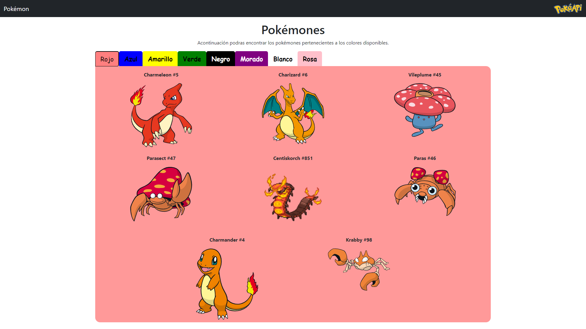

# Pokémones

Aplicación web que comsume la [PokéAPI](https://pokeapi.co/docs/v2) mostrando los pokémones por colores y su informacion correspondiente cuando se da click sobre este.

 

Proyecto generado con [Angular CLI](https://github.com/angular/angular-cli) version 17.0.5.

## Para correr el proyecto

1. Clonar el repositorio
2. Instalar las dependencias con `npm install`
3. Correr el proyecto con `ng serve`
4. Navegar a `http://localhost:4200/`